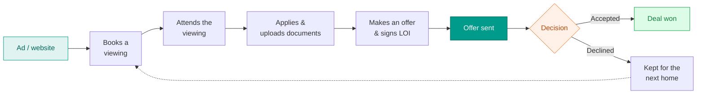
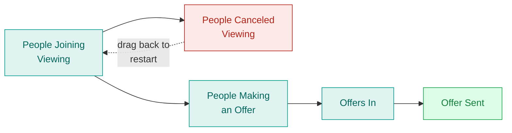
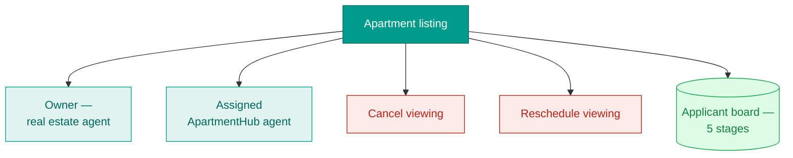
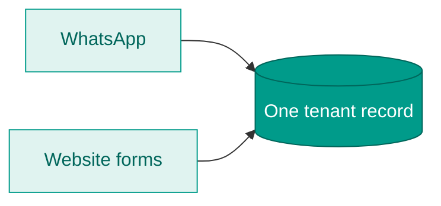
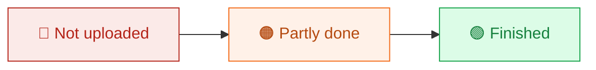
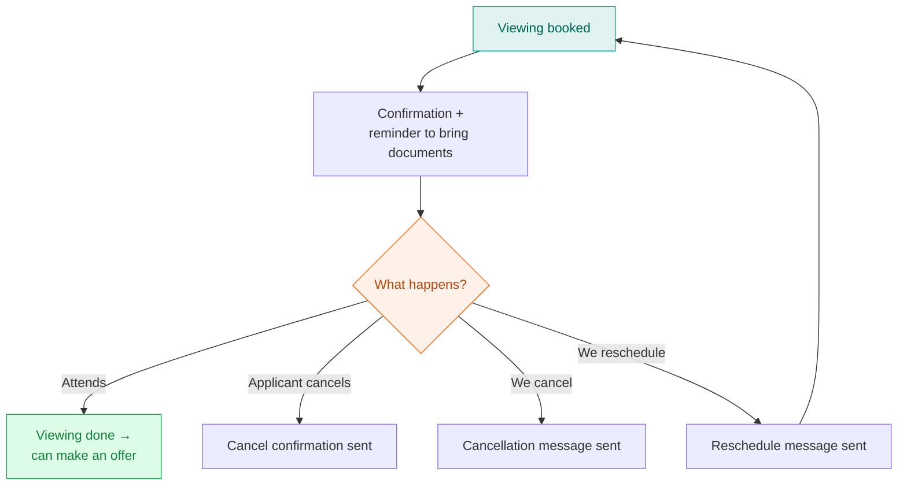
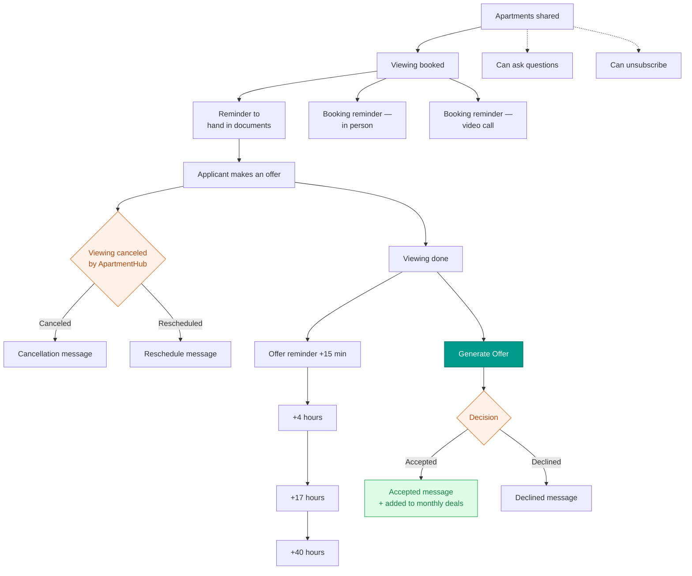
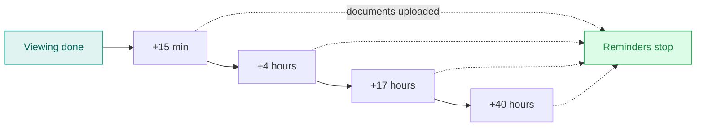
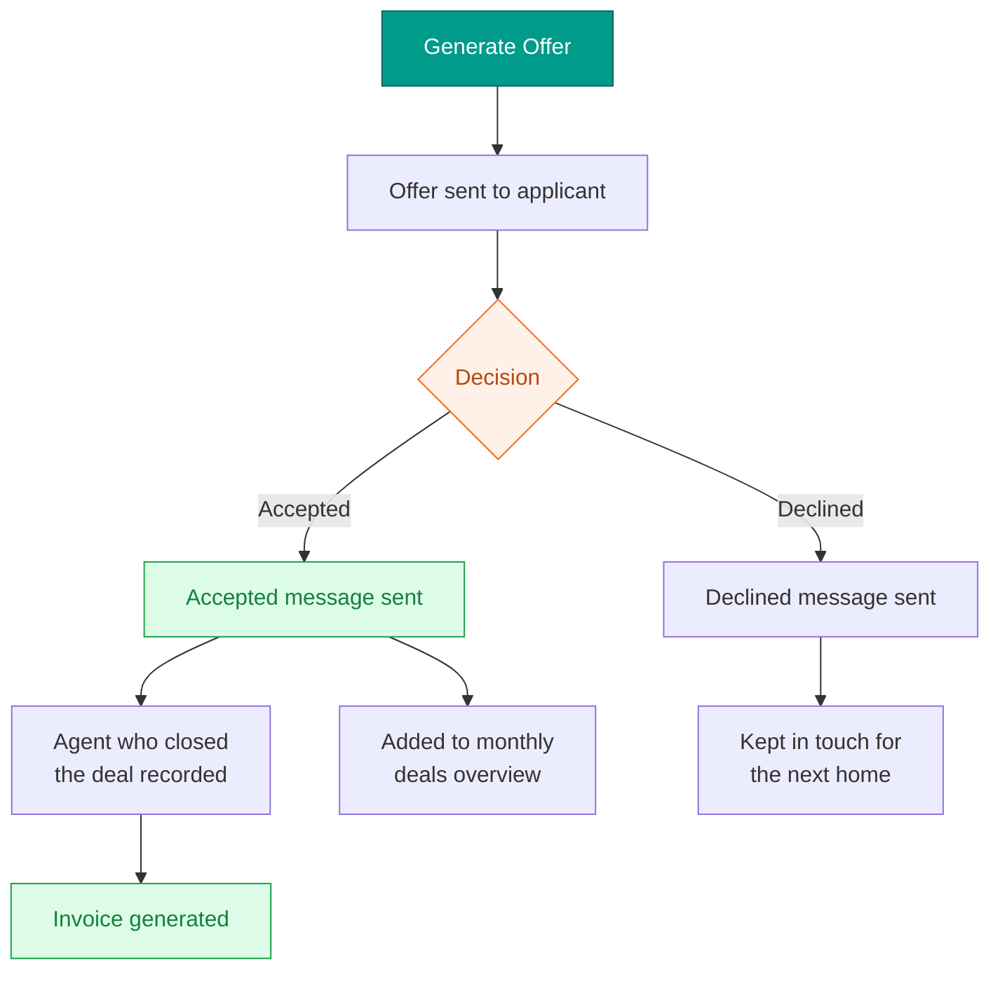

# ApartmentHub — CRM Overview

_How applicants move from a viewing booking to a signed deal, what we keep on each tenant, and the messages that go out automatically along the way. Updated 23 June 2026._

---

## The big picture

From the first viewing booking to a signed deal — everything in one flow.

---

## 1. The pipeline — one board per apartment

Every apartment has its own board that tracks each applicant through five stages. People move forward automatically as they book viewings and fill things in on the website — nobody has to be moved by hand.

| Stage | When someone lands here | What it means |
|-------|--------------------------|---------------|
| **1. People Joining Viewing** | They book a viewing | They're matched to the right apartment automatically. |
| **2. People Canceled Viewing** | They cancel their viewing | Messages to them pause. Drag them back to stage 1 to start again. |
| **3. People Making an Offer** | They log in after the viewing | An offer is in progress — some documents may still be missing. |
| **4. Offers In** | They've uploaded everything and signed the Letter of Intent | The offer is complete and ready for you to review. |
| **5. Offer Sent** | You click **Generate Offer** | Shows how long ago the offer went out and the agent's contact details, with **Accepted / Declined** buttons. |

---

## 2. The apartment

Each listing holds everything about the property and is the home for its board.

| | |
|--|--|
| Apartment name | van Baerlestraat 62-2 |
| Full address | van Baerlestraat 62-2, 1071BA |
| Area | Amsterdam |
| Rental price | €2,800 |
| Bedrooms | 2 |
| Size | 126 m² |
| Viewing length | 5 min slots |
| Notes | e.g. "No students" |
| Listing media | PDF / video link |

On each apartment you can also:

- See the **owner** (the real estate agent for the listing).
- Assign an **ApartmentHub agent** to handle it.
- **Cancel** or **reschedule** a viewing with one click.

---

## 3. The tenant record

For every applicant we keep one tidy record — their details, documents, what they're looking for, and every apartment they've viewed. It fills itself in from two places: their **WhatsApp** contact details and what they **submit on the website**.

**What the record holds**

- **Who they are** — name, phone, WhatsApp, language (Dutch/English).
- **Documents** — status shown at a glance: *not uploaded → partly done → finished*.
- **Their motivation** — taken from the applicant's motivational letter.
- **The offer** — rent offered, deposit, service costs, bid amount, contract start date.
- **Current address** and email.
- **Apartments** — every one they've viewed, and which viewings are still coming up.
- **Co-tenants** — add a partner, housemate, or guarantor and manage their documents too.

**Document status at a glance**

---

## 4. The viewing, step by step

A booking can be attended, canceled, or rescheduled — each path sends the right message and updates the board.

---

## 5. Messages that go out automatically

Throughout the journey, the system sends the right WhatsApp message or email at the right moment — confirmations, reminders, cancellations, and offer follow-ups — so the team doesn't have to chase anyone manually.

- **Document status colours:** green = finished, orange = started, red = not started.
- **Generate Offer** drafts a personalised email from the tenant's details. When an offer is accepted, the deal is added to the monthly deals overview and an invoice can be generated.

**Offer follow-up timeline** — gentle reminders after a viewing, which stop the moment documents are uploaded.

**What happens when an offer is decided**

---

## 6. In short

Everything an applicant does — booking, viewing, uploading, offering, signing — flows into one place, moves them along the board, and triggers the right message at the right time. The team always works from a single, up-to-date view of every tenant and every apartment.
