# ApartmentHub — CRM Overview

_How the CRM is organised, what each section does, and how applicants flow from a first WhatsApp message to a booked viewing and a signed deal. Updated 23 June 2026._

---

## The big picture

From the first message to a signed deal — everything in one place.

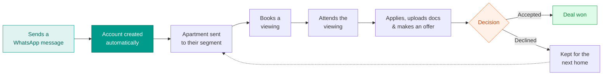

---

## Logging in

The CRM is private. Team members log in with a **password** before they can see any accounts, apartments, or bookings.

---

## The five sections

The CRM is organised into five simple sections.

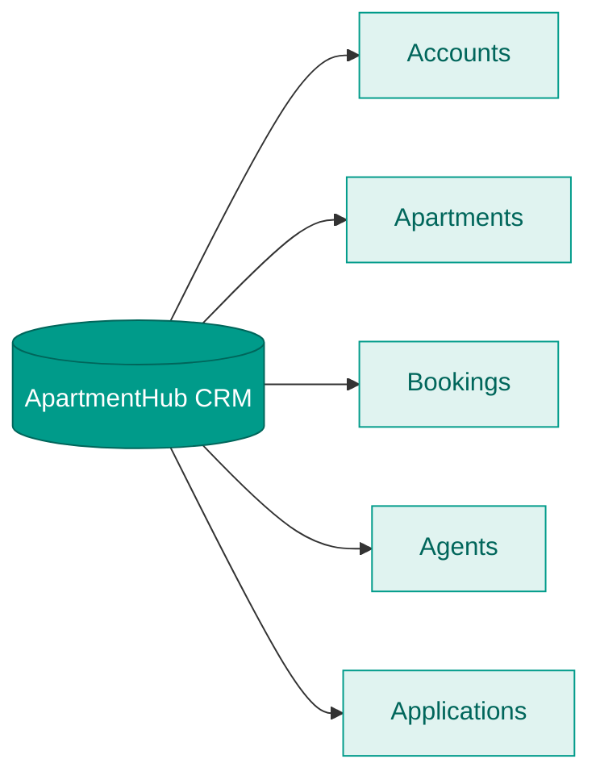

---

## 1. Accounts

Every person who contacts us gets one account — created automatically the moment they send a WhatsApp message.

**How an account is created and kept up to date**

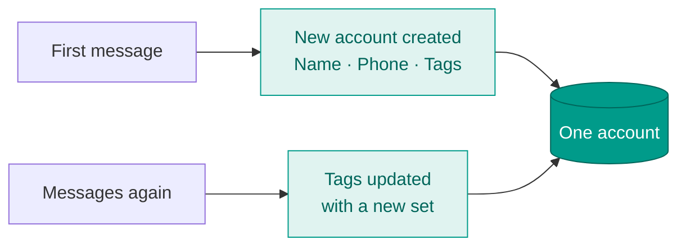

- **On the first message** — a new account is created with **name, phone number, and tags**.
- **On every later message** — the account picks up a **new set of tags**, so it always reflects their latest interests.
- The phone number is the key that ties everything together — it's how we match the account to bookings later.

The account also holds the applicant's motivation and offer details. Uploaded documents live in the **Applications** section (section 5).

---

## 2. Apartments

Where listings are managed — much like an admin panel.

- **Create or delete** apartments at any time.
- Each apartment has a **Segment API ID** — a saved audience of interested people.
- Pressing **Send** broadcasts that specific apartment to its segment, so the right people hear about it.

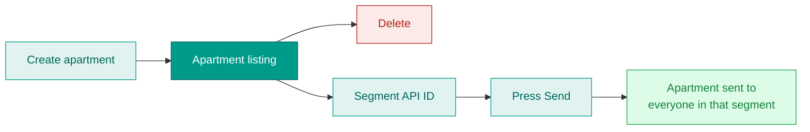

Each listing holds the property details — address, area, rental price, bedrooms, size, viewing slot length, notes, and listing media (PDF / video).

---

## 3. Bookings

All viewing bookings, pulled in from **Cal.com**, shown in one table.

**How a booking is matched to an account**

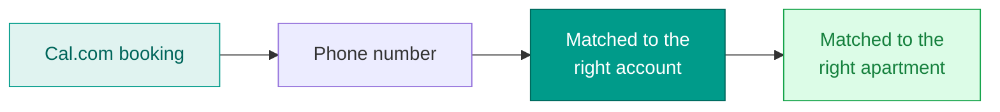

When a booking comes in from Cal.com, the CRM uses the **phone number** to find the matching account, then links it to the right apartment. All booking information from Cal.com is visible here.

This section has four sub-sections:

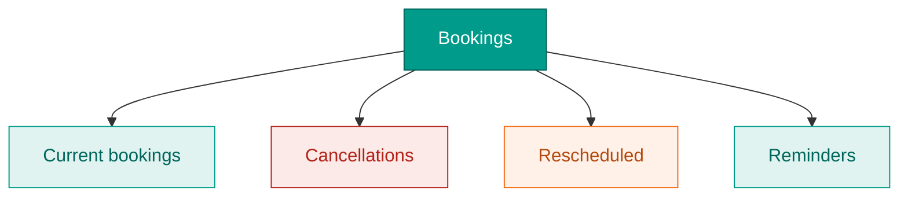

- **Current bookings** — upcoming viewings, matched to their account and apartment.
- **Cancellations** — bookings that were canceled, kept visible in the same table.
- **Rescheduled** — bookings moved to a new time.
- **Reminders** — automatic reminder messages sent **a few hours before each viewing**.

**Reminder timing**

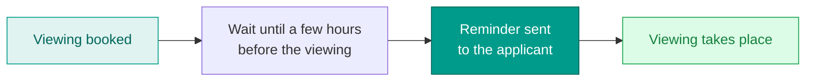

Cancellations and reschedules are picked up from Cal.com automatically and shown in the same place, so the team always sees the current state of every viewing.

---

## 4. Agents

Where the team manages its agents. For each agent you can add:

- **Name**
- **Contact**
- **Phone number**

Agents can then be assigned to apartments and shown on offers as the point of contact.

---

## 5. Applications

An exact replica of the website's application form (`/aanvraag`). Everything an applicant fills in and uploads on the website is reflected here.

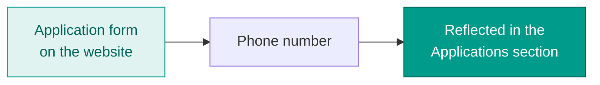

- The form mirrors the website exactly — tenant details, work status, the offer/bid, and document uploads.
- Documents uploaded on the website appear here, **matched by phone number**.
- **All documents are simply uploaded into the Applications section** — including any co-tenant or guarantor documents.

> **Note:** there is **no phone-number matching for co-tenants**. Co-tenant documents are just uploaded alongside the rest in the Applications section, not matched to a separate account.

---

## Confirmed next additions

These five points came out of the scope-overview feedback and are **confirmed for the next build**, on top of the five sections above. They are listed here so the roadmap stays in one place.

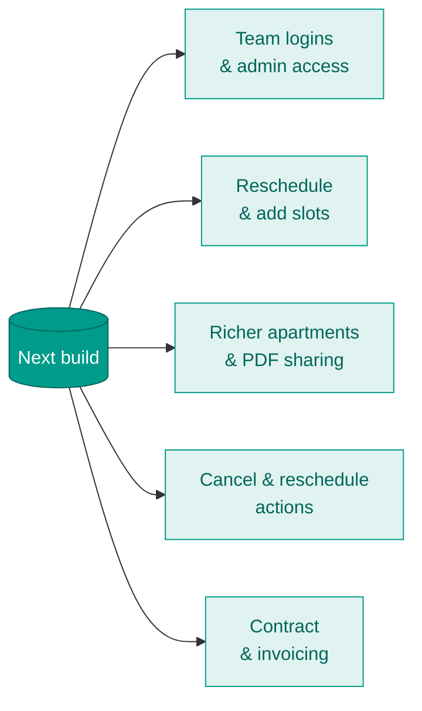

### Team logins & admin access

Today everyone shares one password (see **Logging in**). The next build separates a **team login** from a **client login**, gives each team member their own account, and adds an **admin dashboard** to add employees and manage what each person can see and do.

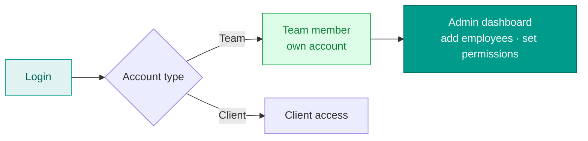

**How we'll build it**

- Today the CRM uses a single shared admin login (`/api/admin/login`, one username/password from env vars, no real session store). We replace this with **Supabase Auth** (email + password) for team members, kept fully separate from the client-side WhatsApp/OTP flow (`AuthContext` → `auth-verify-code`).
- A new **`crm_users`** table holds each team member with a `role` (`admin` / `agent`) and a permissions set.
- Current **RLS policies are permissive** (any authenticated user sees everything). We tighten them to read the role from `crm_users` so access is scoped per role.
- An **admin dashboard** page lets an admin invite/add employees and toggle their permissions — no more shared password.

### Reschedule & add viewing slots

From an apartment, the team can **move (reschedule)** viewing times and **add individual slots**. A **"Generate Nieuwe Slot"** button creates a new slot, and a **bookable link** is shared with the client so they can pick a time themselves.

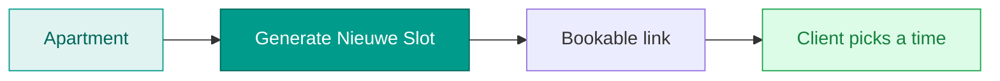

**How we'll build it**

- Viewing slots already run through **Cal.com** — `/api/admin/generate-link` creates the schedule and event types per apartment, and slots are stored on the apartment in the `slot_dates` / `booking_details` JSON fields.
- We add a **"Generate Nieuwe Slot"** action that appends a new slot to that apartment's Cal.com schedule and saves it to `slot_dates`.
- The Cal.com **`eventlink`** is surfaced as the **bookable link** the team shares, so the client self-schedules.
- Rescheduling reuses the existing `booking_reschedules` field and the Cal.com webhook (`/api/webhooks/calcom`) that already handles `BOOKING_RESCHEDULED`.

### Richer apartments & PDF sharing

Building on the **Apartments** section, an apartment gets **more recordable fields** and an **uploadable PDF** that is shared with the segment through the Zoko template **`pdf_apartment_utility`**. This ties into the **Segment API** wiring, and full automation is completed once the Segment API is in place.

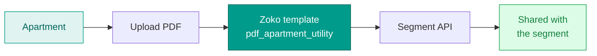

**How we'll build it**

- The `apartments` table already carries most listing fields; we add the remaining **recordable fields** via a migration and expose them in the CRM apartment form.
- The **PDF is uploaded to Supabase Storage** (same pattern as `documentStorageService` / the `upload-document` function), and its URL is stored on the apartment.
- We register **`pdf_apartment_utility`** in the Zoko template registry (`/api/zoko/send-template`, which already holds the existing templates) and pass the PDF URL as a template variable.
- **Send** then pushes the apartment + PDF to the apartment's audience via the **Zoko Segment API** (wired into `apartmentWebhookService` / n8n). Segments today are internal match-logic only, so the full automation lands **once the Segment API is connected** — that's the remaining dependency.

### Cancel & reschedule as active actions

Today cancellations and reschedules are read from Cal.com (see **Bookings**). The next build lets the team **drive them from the CRM**:

- **Cancel viewing** — fires a Zoko template to the client (template provided).
- **Reschedule viewing** — when a new time/date comes from another agent, the meeting is moved and a **new Zoko template fires with slots for the new day**, so people can re-book themselves.

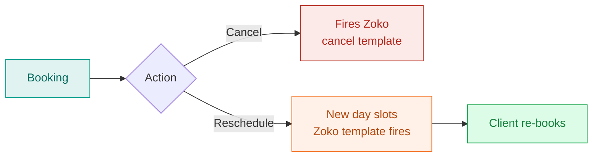

**How we'll build it**

- The plumbing already exists but is **passive** — the Cal.com webhook records cancellations/reschedules, and the `team_cancellation_automation` trigger fires an n8n webhook (`cancelledby-apartmenthub-team`) that moves a participant into `viewing_cancellations`.
- We add **Cancel** and **Reschedule** buttons in the Bookings UI that *drive* this from the CRM:
  - **Cancel** sets the cancellation flag → n8n → fires the provided **Zoko cancel template**.
  - **Reschedule** generates **new-day slots** in Cal.com and fires a **Zoko reschedule template** carrying the slot link, reusing the `booking_reschedules` field and the `tenant_reschedule_reconciliation` logic.

### Contract & invoicing phase

After a deal is won, the CRM adds a **contractual phase** and an **invoicing phase** so the work after the deal lives in the same place. David delivers the invoice template.

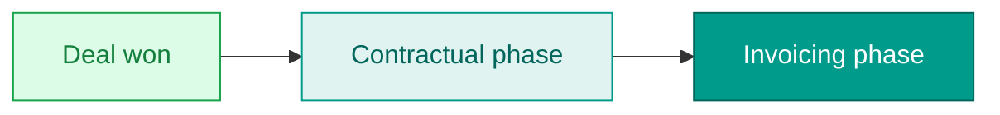

**How we'll build it**

- The deal flow already tracks state — `accounts` has a `Deal Closed` status plus `contract_start_date` / `contract_end_date`, and the selling side (`dashboard-selling`) already has a contract-generation pattern we can reuse.
- We add a **post-deal view** that surfaces the two phases once a deal is won: **contractual** → **invoicing**.
- An **`invoices`** table (linked to the won deal) is added — there's no invoice/payment model today. David's **invoice template** is rendered to PDF using the same HTML→PDF + Resend approach as `send-loi-email`.
- Actual payment processing (Stripe etc.) stays **out of this phase**; this delivers the contract and invoice records and documents.

---

## In short

Everything starts from a single WhatsApp message, which creates an **account**. **Apartments** are sent out to the right segments; the people who respond book viewings, which appear under **Bookings** — matched by phone number and tracked through reminders, cancellations, and reschedules. **Agents** handle the listings and close the deals, and **Applications** mirror the website form so every uploaded document is in one place. All five sections live behind one password-protected login.
