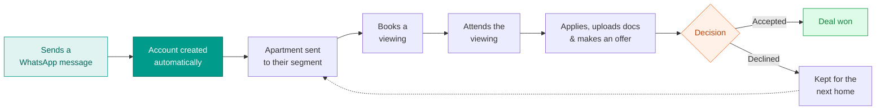
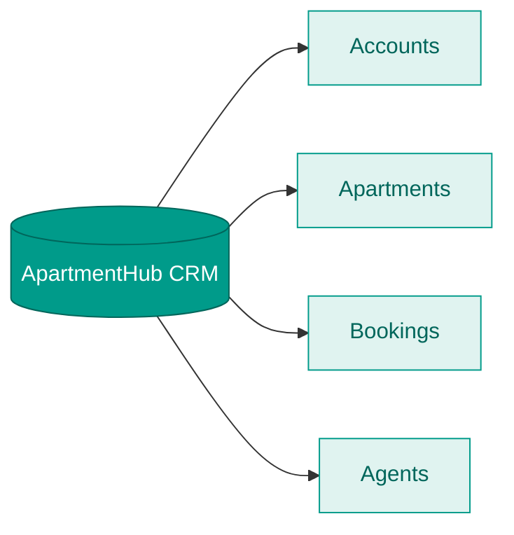
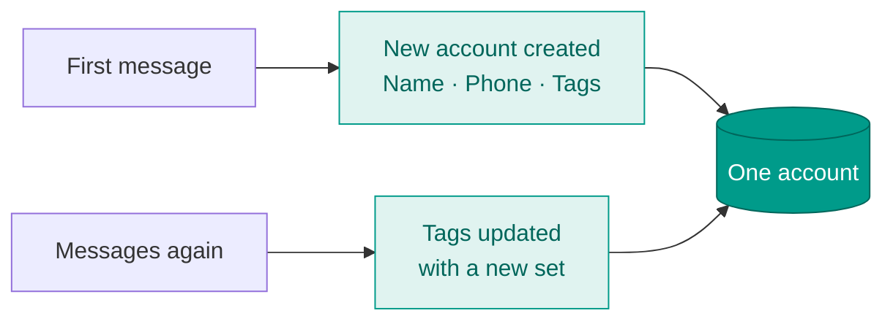
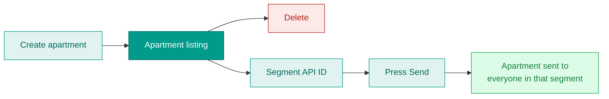
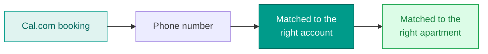
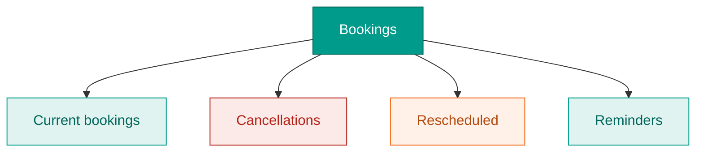
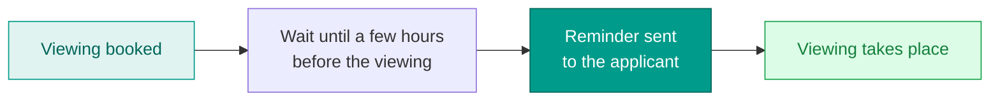

# ApartmentHub — CRM Overview

_How the CRM is organised, what each section does, and how applicants flow from a first WhatsApp message to a booked viewing and a signed deal. Updated 23 June 2026._

---

## The big picture

From the first message to a signed deal — everything in one place.

---

## Logging in

The CRM is private. Team members log in with a **password** before they can see any accounts, apartments, or bookings.

---

## The four sections

The CRM is organised into four simple sections.

---

## 1. Accounts

Every person who contacts us gets one account — created automatically the moment they send a WhatsApp message.

**How an account is created and kept up to date**

- **On the first message** — a new account is created with **name, phone number, and tags**.
- **On every later message** — the account picks up a **new set of tags**, so it always reflects their latest interests.
- The phone number is the key that ties everything together — it's how we match the account to bookings later.

The account also holds the applicant's documents, motivation, offer details, and any co-tenants (partner, housemate, or guarantor).

---

## 2. Apartments

Where listings are managed — much like an admin panel.

- **Create or delete** apartments at any time.
- Each apartment has a **Segment API ID** — a saved audience of interested people.
- Pressing **Send** broadcasts that specific apartment to its segment, so the right people hear about it.

Each listing holds the property details — address, area, rental price, bedrooms, size, viewing slot length, notes, and listing media (PDF / video).

---

## 3. Bookings

All viewing bookings, pulled in from **Cal.com**, shown in one table.

**How a booking is matched to an account**

When a booking comes in from Cal.com, the CRM uses the **phone number** to find the matching account, then links it to the right apartment. All booking information from Cal.com is visible here.

This section has four sub-sections:

- **Current bookings** — upcoming viewings, matched to their account and apartment.
- **Cancellations** — bookings that were canceled, kept visible in the same table.
- **Rescheduled** — bookings moved to a new time.
- **Reminders** — automatic reminder messages sent **a few hours before each viewing**.

**Reminder timing**

Cancellations and reschedules are picked up from Cal.com automatically and shown in the same place, so the team always sees the current state of every viewing.

---

## 4. Agents

Where the team manages its agents. For each agent you can add:

- **Name**
- **Contact**
- **Phone number**

Agents can then be assigned to apartments and shown on offers as the point of contact.

---

## In short

Everything starts from a single WhatsApp message, which creates an **account**. **Apartments** are sent out to the right segments; the people who respond book viewings, which appear under **Bookings** — matched by phone number and tracked through reminders, cancellations, and reschedules. **Agents** handle the listings and close the deals. All four sections live behind one password-protected login.
